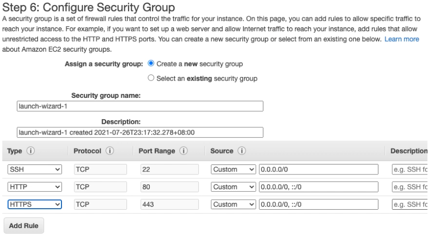

因為有之前學長姐的筆記，其實部署的部分算是蠻成功的，但因為想讓自己加深印象，就順手截圖作筆記起來，以後有需要自己參考。

雖然只是一個步驟一個步驟看影片看學長姐筆記部署成功的，但是看到有自己的網域，有自己的 ip，有自己的資料庫在遠端主機上而不是永遠的 127.0.0.1 ，才驚覺到自己學習做網頁不只是做給自己使用，而是提供一個網頁給需要的人享用。

部署完的網址：

[https://board.techyang.tw/](https://board.techyang.tw/)

[https://todos.techyang.tw/](https://todos.techyang.tw/)

---
### 申請完 AWS 帳號 ➔ 進入主控台  ➔ 先選主機位置( (建議新加坡或東京，離台灣比較近）

### 點選使用 EC2 

### ➔ 接著進入 Step 1: Choose an Amazon Machine Image (AMI)

### Step 2: Choose an Instance Type 
這邊保持預設不變，再往下一步驟

### Step 3: Configure Instance Details
 這邊保持預設不變，再往下一步驟
 
 
### Step 4: Add Storage
預設為 8  GB，或者可以更改到 30 GB 以內。

### Step 5: Add Tags
不用理他，繼續下一步驟

### Step 6: Configure Security Group
這邊要自己手動增加規則，之後再增加也可以。照片只截到新增了 ＳSSH, HTTP, HTTPS，但是依照我的需求，我總共要增加 HTTP, HTTPS, MYSQL/Aurora。

### Step 7: Review Instance Lauch
就是一些作最後確認的動作，接著按 Lauch 。

### 接下來會跳出一個視窗
輸入 Key pair name ，之後按 Download Key Pair，千萬不可以弄丟，更不可以外流。

### 看到這個畫面就代表已經建立 instances 成功

以上步驟無誤後，會跳到執行個體的頁面，如果還 `執行個體狀態` 還沒有顯示執行中，是正常的，大概一兩分鐘就好了。

勾選它後，在靠近頁首的地方有個 `連線` 按下去，會看到下圖，接著選 第三個 `SSH 用戶端`

---
（先不要關掉視窗），同時我們打開電腦的 terminal，

### 先 CD 到你剛下載那個 key 檔案的資料夾下
輸入

`$ chmod 400 檔案名稱` 
`$ ssh -i "檔案名稱" ubuntu@ec2-13-213-15-15.ap-southeast-1.compute.amazonaws.com`

如果你看到類似這個畫面代表連線成功 (好多要擋，乾脆截一半)

### 更新系統
`$sudo apt update && sudo apt upgrade && sudo apt dist-upgrade`
過程中可能會問一些問題，就一路 Y 或 enter 就好。

### 安裝 tasksel
`$sudo apt install tasksel`

### 使用 tasksel 下載 lamp-server
`$sudo tasksel install lamp-server`

下載中的圖片

完成之後在瀏覽器輸入公有 IPv4 地址，看到這個畫面代表一切順利！

---
### 接下來就是建立 phpmyadmin
`sudo apt install phpmyadmin`
有問問題的話就 Y 或 Enter 就好。

看到這個畫面就選 `apache2` (按空白鍵)

選 Yes

建立要進入 phpmyadmin 的密碼，二次確認後就快完成了。

完成之後，進入 Mysql，
`$sudo mysql -u root mysql`

改成用密碼登入
`$ UPDATE user SET plugin='mysql_native_password' WHERE User='root'`

設定完成輸入 `exit` 離開

### 設定 root 密碼
`$sudo mysql_secure_installation`

強度選擇 0，才不會弄的很麻煩。
接著輸入密碼... 以及一路的 yes 到結束。

之後在網址輸入 `(公開 ip)/phpmyadmin`，就可以看到熟悉的 phpmyadmin 登入頁面。

---
## 心得
一路很緊張，但是意外順利！
只有在連 Workbench 的時候有點意外，跟著老師的部屬示範後，調整了一些東西就完成了！
因為進度落後的關係，所以就沒有從零開始自己來，未來打算挑戰 nginx 來部署，還有 GCP 也想來使用看看！
本來已經快忘記的 command line 在這次部署一次複習了，雖然沒有圖形化的介面，但是也悄悄的習慣了！不像剛開始那時候這麼害怕，一直想使用滑鼠。
還有在 SSL ，有看到同學分享怎麼弄，但是那時候我進度還在很前面，所以只是聽聽而已，很後悔沒有筆記下來，不過說真的那時候筆記的話我也不知道筆記什麼，因為我都還沒開始部署...。
這禮拜學到很多專有名詞，不管是資料庫還是部署，一下子湧入好多東西，感覺很難消化，希望自己能夠快點記起來！
最後 SSL 因為想省麻煩省時間，也直接使用 cloudflare 的服務了，簡直我的救命恩人，簡單直覺又夠方便！

> 參考資料
> 
> [
[ 紀錄 ] 部屬 AWS EC2 雲端主機 + LAMP Server + phpMyAdmin](https://mtr04-note.coderbridge.io/2020/09/15/-%E7%B4%80%E9%8C%84-%08-%E9%83%A8%E5%B1%AC-aws-ec2-%E9%9B%B2%E7%AB%AF%E4%B8%BB%E6%A9%9F-/)

> [
AWS EC2 部署網站：卡關記錄 & 心得](https://nicolakacha.coderbridge.io/2020/09/16/launch-website/)