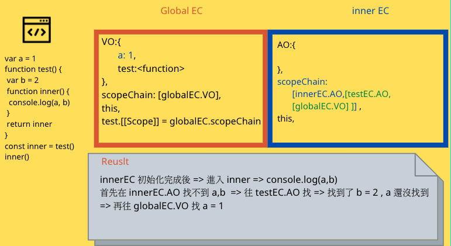

#作業起手式
為了讓作業更完整，我決定把一些基礎知識以及還有在課程上面學到的觀念先整理起來，方便我回答作業，更方便我日後複習更有系統。

## JavaScript 程式執行過程
在過去學 JavaScript （以下簡稱 JS) 基礎語法的時候，可能首要條件是讓程式結果如預期中呈現，重點在練習語法，而先不在意這些看似不重要的基礎。
但也是時候該來了解，整個 JS 執行的過程是如何，或許之後遇到的 bug，我們可以更快更有效率的 debug。

首先我們來看 MDN 對 JavaScript 的介紹 ：
> JavaScript (JS) is a lightweight, interpreted, or just-in-time compiled programming language with first-class functions. While it is most well-known as the scripting language for Web pages, many non-browser environments also use it, such as Node.js, Apache CouchDB and Adobe Acrobat. JavaScript is a prototype-based, multi-paradigm, single-threaded, dynamic language, supporting object-oriented, imperative, and declarative (e.g. functional programming) styles. Read more about JavaScript.

中文
> JavaScript (簡稱 JS) 是具有一級函數 (First-class functions) 的輕量級、直譯式或即時編譯（JIT-compiled）的程式語言。它因為用作網頁的腳本語言而大為知名，但也用於許多非瀏覽器的環境，像是 node.js、Apache CouchDB。JavaScript 是一個基於原型的 (Prototype-based (en-US))、多範型的、動態語言，支援物件導向、指令式以及宣告式 (如函數式程式設計) 風格。 閱讀關於 JavaScript 以取得更多資訊。 

我們可以從這段介紹以及我自己爬文搜尋到的資訊，整理出 JavaScript 幾個重要的特性。

- High-Level：JS 為 High-level 語言，low-level 的語言代表是 C, 低階語言與電腦溝通比較容易，但與人溝通 (學習) 比較不容易，而在高階語言中像是 JavaScript 或 Python 比起低階語言更直覺，使我們人類比較容易學習，但是犧牲的是效率沒有低階語言那麼快。
- 回收機制：在 JS 中，有個機制是可以自動刪除沒有在使用的 object，刪除後會釋放記憶體。
-  Just-In-Time (interpreted)：我們都知道和電腦溝通，我們只能用 0 和 1，所以我們在寫 JS 與電腦溝通的時候，是需要經過『翻譯』後，才能讓電腦懂我們在說什麼，總之不管什麼程式語言最後都是需要經過編譯，才能讓電腦動起來。
-  multi-paradigm ：不同於其他程式語言，JS 可以實現 Procedural programming, Object-oriented programming, Functional programming。(這部分我自己還不是搞得很清楚，先簡單帶過。)
- prototype-based：JS 中除了 primitive value 之外，都是 Object。而當我們使用 array 時，我們可以使用 push 去新增元素或者使用其他不同 array 的 method， 這就是利用 prototype 特性去使用 method。
-  first-class functions：因為這個特性，所以我們可以把 function 當成像變數一樣傳過來傳過去的。
-  dynamic：當我們在宣告一個變數的時候，我們並沒有去指定此變數的類型( number, string,...)，就算一開始將一個 number 賦值給變數，之後又可以改成放字串，例如：

 ```
 var a = 666 
 a = "OMG"
 ```
-  single-threaded : 簡單的說就是 JS 在同一時間只能做一件事情，但是經過 event loop，我們可以使得需要耗時的程序先擱著，等它完成後再來處理。


這邊就是幾個 JS 主要特性，或許獵得不夠完整也講得不夠深入，但應該足夠等等來回答作業使用。

---

學習到這邊，我們都知道 JS 不只是可以在瀏覽器環境下執行，非瀏覽器下環境也是可以讓 JS 跑起來的( node.js,...)。

> (以下假設是在瀏覽器環境下執行 JavaScript 來做解說，但其實概念大同小異！)


##JavaScript Engine 
JS Engine 的存在是讓我們可以把執行 JavaScript 程式碼，每個瀏覽器都有自己執行 JS 的 JS Engine。
> JS Engine，做的事情很簡單，就是幫我們把程式碼『翻譯』給電腦就是了，在翻譯的過程中會去做幾件事，首先會先解析我們的程式碼，在這階段換先檢查我們的語法是否有錯誤，以及是否有宣告變數(宣告而已還沒執行) => 再來才是真正的編譯成電腦會懂的語言(0,1)，然後最後就是逐步執行我們寫的程式。(其實應該不是那麼簡單而已，但再探究下去就超出我能力範圍了，以後有空再來探討)


我們最常使用的 Chrome 瀏覽器就是使用 V8 Engine 來執行 JavaScript 的。
JS Engine 包含了很重要的東西 `Call Stack` 和 `HEAP`。
Call Stack 是放著 Execution Context 的地方，也是執行程式的地方 。
Heap 就是內存記憶體，裡面就是放著程式需要的 Object, 變數 ... 等。


但是單有 JS Engine 並不足夠，這就像你現在只是擁有了火跟鍋子就說你擁有了廚房一樣，我們勢必需要流理台，烤箱，刀子...等等一堆工具來強大我們的廚房。所以在瀏覽器下執行 JS ，我們就需要 Web API，Web API 提供了許多功能讓我們可以在使用，像是 DOM, setTimeout, fetch API, 甚至是我們已經用到快爛掉的 console ... 等，Web API 提供的這些功能並不是 JavaScript 這語言本身的一部份，是 JavaScript 透過 window 這個 Object 來使用 Web API 提供的功能。

簡單的說，在瀏覽器環境 (runtime) 下執行 JavaScript 的話，這個環境中就會包含了幾個主要的東西， JS Engine, Web API, 還有 Callback Queue, 裡面是放 callback function，例如像是監聽 click 事件的 handler function，或是 setTimeout 的 callback funtion，...等。

## Event Loop
現在我們有了幾個關鍵的名詞介紹，Call Stack, Web API, Callback Queue 了，這樣我們就可以來認識建構在這幾個名詞上的 Event Loop。


剛剛提到的  Event Loop ，其實就是圍繞著 Call Stack, Web API, Callback Queue ，這幾個名詞上面，可以想像成瀏覽器是一個廚房，在廚房裡面煮菜我們會有幾個流程，Call Stack 裡面會放著完成一道菜的步驟， Web API 是其中某個步驟裡面的一項工作，就像是幫我們備料一樣，而Callback Queue 就像是 Web API 幫我們備完料的食材，準備放入 Call Stack 裡完成，最後 heap 不是不重要，而是他就只是個內存記憶體，就像是廚房裡那個放著一堆醬料的儲藏架或者只是個冰箱而已。


剛剛提到的 JS Engine 的編譯過程，還有一部份沒有提到，就是在正式執行之前，JS 會產生出 Execution Context (簡稱 EC)，第一個產生的為 `Global Execution Context `，global EC 裡面會放著我們需要的東西，例如變數的宣告，還有哪些是 function 的宣告，但要注意並不包含 function 的 body，也不包括賦值，可以把 EC 當成一個 object 來看的話就像是這樣：

```
var a = 666
function print() {
	console.log(a)
}
print()
```


```
global EC {
	a : undefined,
	print: function
}

```
可以把 EC 想像成一個 JavaScript 完整程式碼中一小片段，裡面放著我們需要的資訊，或是模擬成要完成一道菜的食譜中的某個步驟，而 global EC 就是主廚，global EC 只會有一個，其他的 function EC 就像是二廚，廚助...。


global EC 為程式執行前第一個會生成的，再來遇到有 function 呼叫時才會再生成一個 EC，如果這個 EC 執行完畢就會消失，一直到連 global EC 都消失為止才是完整的結束。


> Event Loop 的細節會在 hw1 及 hw2 中再做更深入的解釋。

---

## EC 裡面裝些什麼？Scope Chain 怎麼來的 ？
當我們遇到 function 被呼叫時，JS 生出 EC，每一個 EC 都會有 variable Object (之後簡稱 VO),   這個 VO 裡面初始化function 裡面的變數以及 function 的宣告。

初始化：

```
EC: {
	VO{
		a:undefined
	}
}

function test() {
	var a = 666
}

test()
```
EC 初始化後，進入執行階段後會變這樣：

```
EC: {
	VO{
		a:666
	}
}

function test() {
	var a = 666
}

test()
```
如果 function 帶有參數的話呢？  有值的會帶入值，如果沒有值就會初始化成 undefined。

```
EC: {
	VO{
		a:666,
		b:undefined
		
	}
}

function test(a, b) {
	//...
}

test(666)
```


而如果遇到 function呢？ 一樣會先初始化。

```
EC: {
	VO{
		a:666,
		b:undefined,
		c:function
		
	}
}

function test(a, b) {
	//...
	function c () { //... }
	c()
}

test(666)
```

那如果剛好這個 function 跟 參數名字一樣呢，那就會被取代：

```
EC: {
	VO{
		a: <function>,
		
	}
}

function test(a) {
	
	function a () { //... }

}

test(666)
```

而對於如果遇到宣告的變數是同名呢？ 那就會蓋過去。如果原本沒存在的，就是 undefined。


```
EC: {
	VO{
		a: 666,
		b: <function>,
		c: 888
	}
}

function test(a,b) {
	function b () { //... }
	var a = 777 // 被跳過了
	var c = 888

}

test(666)
```

好，這只是 EC 裡面 VO 的部分， EC 裡面還有一個很重要的東西叫 Scope Chain，當我們進入 EC 時，會建立 VO 以及 建立 Scope Chain  還有個 this，而且如果 VO 裡面也有 function 宣告的話會為這個 function 建立 [[Scope]]，而 Scope Chain 跟 VO 一樣，也是在做初始化的事情。

> 如果此 EC 是 global EC，則 global EC 中的 Scope Chain 就稱為 global variable object (global VO)。

如果是此 EC 是 function 的話，就會有 `activation object` (簡稱 AO)，，什麼是 AO 呢？ 可以把他跟 VO 當成是一樣的就好，只是在 global EC 裡面我們稱為 VO，在 function EC 裡我們稱為 AO。 

> function EC 跟 global EC 一樣 裡面放著 variable object 、function EC 的 Scope Chain (自己的AO + function EC的 [[Scope]] )、this、以及如果有遇到 function 的宣告就產生的 `[[ Scope ]]` 

我們帶個例子來看會比較清楚：

```
var a = 1
function test() {
	var b = 2
	function inner() {
		var c = 3 
	}
	inner()
}
test()
```

首先是進入 global EC ：


> 此時的 global.scopeChain = [globalEC.VO]

> 此時的 test.[[Scope]] = globalEC.scopeChain =  [globalEC.VO]
 
 之後執行完畢，會遇到 test() ，一樣先初始化：
 
> testEC.scopeChaine = [testEC.AO, test.[[Scope]] ]  = [testEC.AO, [globalEC.VO] ] 

> inner.[[Scope]] = testEC.scopeChain 


初始化完成，繼續執行 => 遇到 inner() => 初始化 inner :
 
> scopeChain: [innerEC.AO,testEC.scopeChain] = [innerEC.AO, testEC.AO, gloEC.VO]


## hoisting
認識了 Scope Chain 後，默的就幫我們演示了一層一層往上找的 Scope Chain 的及 hoisting 過程了，不是嗎？

> 進入 某 EC 的時候，會先宣告變數或 function，因為還沒有賦值，在執行賦值之前如果我們去使用變數，這個時候的變數就是 undefined，如此而已。

例如當我們在宣告變數之前就使用變數的話，是不會丟出錯誤的，只是會變成 undefined。

```
console.log(b) // undefined
var b = 666
```
其實我們可以解讀成這樣子：

```
var b
console.log(b)
b = 666

```

還有我們常使用的 function 也是有 hoisting 的效果，看下面的例子，程式不會報錯
，也會順利執行 test function 。

```
test()
function test(){
	//....
}
```

再提供一些比較 tricky 的例子：

```
var a = 666
function test(){
	console.log(a)
	var a = 777
}
test()
```
曾經的我，一直覺得他會 console 666 ，但其實不是喔！！！ 因為在建立 testEC AO 的時候，我們將 var a 放進去了，所以進入賦值之前是 undefined 。

還有 function 宣告 hoisting 會比變數還高 ：

```
function test(){
	console.log(a) // <function>
	var a = 777
	function a() {
		console.log('OMG')
	}
}
test()
```

那麼如果是帶參數的 function 並且又宣告一樣的變數呢？ 這樣參數會蓋過去。

```
function test(a){
	console.log(a) // 666
	var a = 777
	console.log(a) // 777
}

test(666)
```

但是如果 function 的話，優先度會提高：

```
function test(a){
	console.log(a) // <function>
	function a(){
	}
}

test(666)
```

> 總之優先順序是 1. function > 2. arguments > 3. var 

還有要注意在寬鬆模式下的話，如果有個變數在 global 中沒有宣告，但是在 function 裡面出現一個沒宣告過的變數，但是有給賦值，JS 就會在 global 新增這個變數，並且給予值。(如果是嚴格模式下就會報錯)

```
function fn(){
  fn2()
  function fn2(){
    b='OMG'
  }
}
fn()
console.log(b) // OMG
```


### let, const 與 var
let, const 與 var 最大的不同是， var 變數的生存範圍是以 function 區塊來界定，然而 const, let 是以 block 來界定的。
比如說 `if { .... } ` 或迴圈都是 block，如果在 block 裡面使用 let, const ，在 block 外面使用變數的話是會報錯的。

### Temporal Dead Zone，TDZ
之前的我一直以為 let, const 是沒有 hoisting 的，但是如果沒有 hoisting ，下面的程式會跑出 666 才對，但卻是跑出 ` ReferenceError ...`。
```
let a = 666
function test(){
	console.log(a)
	let a = 777
}
test()
```

let 與 const 其實是有 hoisting 的，但不是像 var 一樣，初始化時會是 undefined，並且在賦值以前如果去存取，會拋出錯誤。

> 在 hoisting 至 賦值以前 這段時間，我們稱它為 TDZ，在這段時間內存取該變數，會拋出錯誤！

```
let a = 666
function test(){
	// ======= a TDZ 開始
	console.log(a)
	.
	.
	.
	let a = 777	// ======= a TDZ 結束
}
test()

```

```
let a = 666
function test(){
	test2()	// ======= a TDZ 開始	
	let a = 777	// ======= a TDZ 結束
	funciton test2(){
		console.log(a)
	}
}
test()
```
總之，就是記得賦值以前去存取 let 與 const 宣告的變數，會發生錯誤就對了。


## Closure
有了以上的概念之後，這樣就可以幫我們更理解 closure ：

```
var a = 1
function test() {
	var b = 2
	function inner() {
		console.log(a, b) // 1 2
	}
	return inner
}
const inner = test()
inner()
```
 

global EC => 執行 => testEC => 執行 ：
 

剛剛有上面有解釋 EC 過了，這邊就不多講了。
那當 test 執行完之後，此時 b=2 ，然後 return inner，照理來說，這個 testEC 就會消失被回收了，但是 `inner.[[Scope]] = [testEC.AO, globalEC.VO]` 會被留存，因為 JS 知道我們待會會使用到。
`[testEC.AO, test.[[Scope]] ]  = [testEC.AO, [globalEC.VO] ] 被保留起來！`

 
 
 好的，回傳了 inner 之後，程式遇到 inner() => 初始化 inner EC ：

  
 
好的，這邊也就解釋 closure 原理 了，由此可知如果當 b = 2 換成是 b = {超級大 object}，那麼這個超級大 object 就會被保留起來，但是我們可能只是需要其中的一小部分，這樣就太浪費空間了，所以使用上要小心！

還有，我覺得老師舉的例子有深刻的讓我體會到 closure 的效率，就是當我們需要重複計算複雜的計算的時候，我們可以利用 closure 的原理更有效率的執行程式：

```
function complex(n) {
	console.log('進入運算')
	return n*n*n
}

function cache(fn){
	var ans = {}
	return function(n) {
		if(ans[n]) {
			return ans[n]
		}
		ans[n] = fn(n)
		return ans[n]
	}
}

const cachedComplex = cache(complex)

console.log(cachedComplex(10)) // 進入運算 1000
console.log(cachedComplex(10)) // 1000
console.log(cachedComplex(10)) // 1000
console.log(cachedComplex(10)) // 1000

```

神奇吧，把答案放入一個變數中，這樣就不用每次都要進行運算。

另外再提一個也是在 closure 中，我經常會搞到很混亂的例子：

```
var arr = []
for (var i =0; i< 5; i++){
	arr[i] = function(){
		console.log(i)
	}
}

arr[0]()
```
我們可能會預期 `arr[0]()` 會 console 出 0，`arr[1]()` 就 console 出 1，但發現結果都是 5。

在我們學了作用域，學了 closure 之後，我們應該要很清楚的知道，為什麼答案是 5 而不是我們想的那樣。這是因為 var 的特性，我們實際上在執行 `arr[0]()` 的時候，此時的 i 是 global 的 i ，已經變成 5 了。

而關於此解法最簡單的就是將 `var i = 0` 改成  `let i = 0` 就可以了 。

或者是我們可以專業的使用 closure 的方式來解決：

```
var arr = []
for (var i =0; i< 5; i++){
	arr[i] = logN(i)
}

function logN(n) {
	return function(){
		console.log(n)
	}
}
arr[0]()
```

最後還有 IIFE 的方式：

```
var arr = []
for (var i =0; i< 5; i++){
	arr[i] = (function(n){
		return function(){
			console.log(n)
		}
	})(i)
}

arr[0]()
```

### closure 的應用
實務上使用 closure 的時候是在想要隱藏某些資訊的時候，來讓其他人不能從外部更改值。

老師舉了一個例子我覺很不錯：

```
var money = 99
function add(num) {
	money += num
}
function deduct(num) {
	if(num >=10) {
		money -=10
	} else {
		money -=num
	}
}
add(1)
deduct(100)
console.log(money) //90
```

看似沒問題，但是如果其他人隨便在程式放上 `money = -1` 那 money 就會簡簡單單的變成 -1 了。

這時候就需要 closure 去把變數封裝起來預防這種行為：

```
function createWallet(initMoney){
	var money = initMoney
	return {
		add: function(num){
			money +=num
		},
		deduct: function(num){
			if(num >=10) {
				money -=10
			} else {
				money -=num
			}
		},
		getMoney() {
			return money
		}
	}
}

var  myWallet = createWallet(99)
myWallet .add(1)
myWallet .deduct(100)
console.log(myWallet.getMoney()) //90
```

這樣子改寫之後，就算有人執行 `myWallet.money = -100` ，myWallet 的 money 也是不會改變的。

這個 wallet 的例子中，雖然是利用 closure 的概念去實作，但是其實已經有散發出物件導向的氣味出來了。

是的，接下來就要筆記我自己覺得困難度最高的一部份，JS 的物件導向。

## JS中的物件導向
在 ES6 以前，還沒有 class 可以來創建一個類別，類別可以想像成定義一個 object 的設計稿，我們可以透過 class 來描述一個 object 長什麼樣子，通常這個 object 我們稱為 instance，例如你創建了一個手機的設計稿，設計稿裡面有描述手機該叫什麼名字，有什麼功能可以使用，而當我們去規範這個一支手機叫 'iPhone'，並且有打電話這功能，那這支手機我們稱為 instance。 

即使在 ES6 以前沒有 class 可以使用，我們仍然 function 的方式去實現物件導向的概念，或許之前我們已經常使用類似的概念的，可能我們沒有發現而已。

以下是簡單的例子：

```
function Phone(name){
	var myName = name
	return {
		getName: function(){
			return myName
		},
		calling: function() {
			console.log(myName + ' => call someone...')
		}
	}
}

var iPhone = Phone('iPhone')
iPhone.calling()

var s3 = Phone('S3')
s3.calling()
```

我們創建了兩支手機，iPhone 和 S3，並且他們都有打calling的 method 可以使用。所以理論上 iPhone.calling === s3.calling 應該要是 true 才對，但其實會回傳 false，由此可知當我們創建了一萬支手機，我們就會創建了一萬次 calling 這 method，這不符合邏輯，因為所有手機應該都要共用 calling。

所以我們改寫了一下程式：

```
function Phone(name){
	return this.name = name
}

Phone.prototype.getName = function(){
	return this.name
}

Phone.prototype.calling = function(){
	console.log(this.name + ' => call someone...')
}

var iPhone = new Phone('iPhone')
iPhone.calling()

var s3 = new Phone('S3')
s3.calling()

```

注意到我們使用了關鍵字 `new` 來新增一個 instance，還有利用 `prototype` 來創建共用的 method，並且現在 `iPhone.calling === s3.calling` 就是 true 了。

其實每當我們新增一個實例的時候 JS 會幫我們建立 `__proto__`，而這個 `__proto__` 就是 Phone 的 `prototype` 。

`iPhone.__proto__ === Phone.prototype	//true`

當我們輸入 `iPhone.calling()` 的時候會發生一些事：

- iPhone 本身有沒有 calling 
- iPhone.__proto__ (Phone.prototype) 有沒有 calling
- iPhone.__proto__.__proto__ (Object.prototye) 有沒有 calling

是一層一層往上找的概念，這就是 `prototype chain` 原型鍊，那麼如果真的連 Object.prototype 也找不到呢，就會找到最頂層，回傳 null，那麼 iPhone.calling() 就會回傳錯誤。

由此可知，其實我們可以在 Object 上加上 prototype ，這樣 iPhone 一樣也可以使用 calling。

其實我們很常使用一些 method，像是 Array 的 push, join, .....這些，就是利用 prototype 的特性，當我們建立一個 array 的時候這個 array 的 __proto__ 會與 JS中 Array.prototype 連接起來，所以我們才可以使用 Array.prototype 的 method。(正確來說是我們新增的 array 會繼承了 Array.prototype 的所有屬性和方法)

```
let arr = []
console.log(arr.__proto__ === Array.prototype) // true
console.log(arr.__proto__) // 會列出所有 Array 可以使用的 method
```

那麼 `__proto__` 是怎麼來的呢，其實是因為 `new` 這個關鍵字在背後幫我們做了幾件事情，你可以把它想成這是以下這樣：

```
function Phone(name){
	return this.name = name
}

Phone.prototype.getName = function(){
	return this.name
}

Phone.prototype.calling = function(){
	console.log(this.name + ' => call someone...')
}

// new 的工作在這裡
function newPhone(name) {
	var obj = {}
	Phone.call(obj, name)
	obj.__proto__ = Phone.prototype
	return obj
}

// 這樣就可以不用 new 了
var oppo = newPhone('oppo')
oppo.calling()
```

new 的主要工作就是生成一個 Object，然後重點在將這個 Object 的 __proto__與 Phone 的 prototype 接起來，然後再回傳這個 Object，我們就可以使用 calling 了。

以上都是介紹 ES5 實現類別與實例的方式，那到了 ES6 之後，我們就有了 `class` 來取代這個 function ，但其實背後做的事情是差不多的。

```
class Phone{
	
	constructor(name) {
		this.name = name
	}
	
	getName(name) {
		return this.name
	}

	calling() {
		console.log(this.name + ' => call someone')
	}
}

var iPhone = new Phone('iPhone')
iPhone.calling()

```

注意這個 `constructor`，是使用了 class 自動幫我們創建的，裡面會放著我們對該實例的描述。
 
最後，在物件導向中有個很重要的觀念就是繼承，`extends`。

假如我們現在新增一支手機，一樣有 calling 功能，也跟剛剛新增的手機一樣有名字，但這支手機可以照相其他手機不行，我們就可以使用繼承的概念實現，因為只是多了一個其他手機沒有的功能而已，剩下的都共用。

```
class Phone{
	
	constructor(name) {
		this.name = name
	}
	
	getName(name) {
		return this.name
	}

	calling() {
		console.log(this.name + ' => call someone')
	}
}

class PhoneM extends Phone {
	constructor(name) {
		super(name)
	}
	takePhoto(){
		console.log(this.name + ' => taking photo')	
	}
}


var iPhoneM = new PhoneM('iPhoneM')
iPhoneM.calling()

```

其實生活上很多例子都跟物件導向有相關，例如有個類別是 user，那就可以創建很多個 user 出來，每個 user 有不一樣的 id 但是都有著一樣的 method 可以使用，例如登入、新增文章....之類的，那我們可以使用繼承的觀念去新增一個 user 是 admin ， 因為 admin 其實很多 method 和屬性都跟 user 共用，可能只是多加一個可以刪除文章的功能，當然生活上其實很多東西可以想成是類別與實例來看！這樣或許就不會那麼難理解了。

---

在以上我們大概知道了物件導向是什麼東西，也用了 JS 去簡單的示範怎麼呈現類別與實例，接下來我將這些片段整理一下，首先我們要知道設計物件導向的類別的時候幾個大觀念：

- 抽象化 Abstraction：簡單的說，就是在抽象化概念中我們不需要去談細節，就像你在使用 setTimeout 或 監聽事件的時候，我們並不需要去知道運作的細節，我只要知道怎麼去使用，所以在設計類別的時候我們要站在使用者的角度，我只要讓使用者知道怎麼使用就好。
- 封裝 Encapsulation：我們應該要明確定的定義哪些屬性是可以對外開放，哪些是不希望可以從外部被操控。
- 繼承 Inheritance：就像剛剛舉的 user 與 admin 的例子，當我們建立 user 和 admin 類別時，實際上 admin 也是其中一個 user，所以 admin 應該要繼承 user 可以使用的屬性，並且 admin 有著自己獨有的屬性，總之，user 是 admin 的 parent 。
- 多型 Polymrophism：可以想像成多型就是指一個類別可以再延伸出多個子類別，而此這些子類別有許多跟父類別共用的屬性，跟父類別有點相似但其實有一些不一樣。(其實這部分我還沒有到非常懂啦，先解說到這邊)


好了，現在對 JS 的物件導向有了基本認識之後，我們可以來認識 `this` 這個大魔王了

---
## this
剛剛提的那些物件導向的例子，我們使用到了很多次 `this` ，this 就是一個提供給物件導向來使用的，因為有了 this ，這樣 JS 才知道我們是指哪一個實例。

但是在物件導向以外也是可以使用 this，只是值可能會和在物件導向不一樣，例如在瀏覽器下 this 預設值就是 window，node.js 下就是 global，而且如果你是以嚴格模式 ( 'use strict' ) 下的話，this 就會變成 undefined。

```
'use strict'
function test(){
	console.log(this)	// undefined
}
test()
```

### call 與 apply
不過，如果在呼叫 function 時是使用 `call` 或 `apply` 的話，this的值就會不一樣了，此時的 this 就會取決  `call` 或 `apply`  的第一個參數是什麼。

```
'use strict'
function test(){
	console.log(this) // OMG
}
test.call('OMG')
```

學了 call ，之後我們就可以利用 call 來更了解 this：

```
'use strict'
const obj = {
	a: 666,
	inner: {
		test: function() {
			console.log(this)
		}
	}
}

obj.inner.test()	//{test: ƒ}
```

此時當你在執行 `obj.inner.test()` ，可以想像成像這樣 `obj.inner.test.call(obj.inner)` 。

如果我們新增一個變數放 obj.inner.test ，然後去呼叫呢？

```
'use strict'
const obj = {
	a: 666,
	inner: {
		test: function() {
			console.log(this)
		}
	}
}

const fn = obj.inner.test
fn()
```

在嚴格模式下，去呼叫 fn 的話，我們會得到 undefined，在寬鬆模式下，我們會得到 winodw。如果你用 call 去理解的話，就不會覺得那麼弔詭了，
當我們執行 `fn()` 就等於 fn.call(undefined) ，因為 this 取決於我們怎麼呼叫 function，如果是使用 call 或 apply 就是看第一個參數放什麼。

### bind
bind 的行為跟 call 與 apply 很像，只是 call 與 apply，會直接呼叫 function，而 bind 是回傳一個 function。

```
'use strict'
const obj = {
	a: 666,
	inner: {
		test: function() {
			console.log(this)
		}
	}
}

const fn = obj.inner.test.bind('OMG')
fn()
```

this 會取決於 bind 的參數是什麼，所以此時就算使用 call 呼叫 fn `fn.call('666')` ，也是一樣會回傳 OMG。

### arrow function 中的 this
arrow function 裡面的 this，跟剛剛說的 this 規則，是不一樣的，arrow function 裡面的 this，會取決於作用域。

```
'use strict'
const calcAge = function (birthYear) {

  console.log(2021- birthYear)	 //32
  console.log(this) // undefined
}
calcAge(1989) 

```
如果改成 arrow function 的話

```
'use strict'
    const calcAge = (birthYear) => {

      console.log(2021 - birthYear) //32
      console.log(this) //window
    }
    calcAge(1989)
```
為什麼會回傳 window 呢，這是因為在 arrow function 裡面的 this，其實就是上一層的 EC 裡面的 this，而上一層的 this，就是 window。


對於 this 和 JS 中的物件導向 有了一定的基礎概念後，現在我們可以來到最終章，再一次複習在 JS 中要怎麼實現物件導向的類別與實例 ：


## 使用 constructor function 的方式實現物件導向


```
const User = function(username, greetWord){
  this.username = username
  this.greetWord = greetWord
}

// instance1
const yang = new User('Yang', 'Hello')

// instance2
const ashi = new User('Ashi', '哩賀')


```

再次複習一下 `new` 關鍵字做了些什麼事情：

首先會建立一個 object {} => 然後呼叫 User，此時的 this 就會是這個 {} => 執行 User 裡面的程式 `this.username = username //省略.... ` => 偷偷的把 {} __proto__ 與 User 的 
prototype 連接起來  => 回傳這個 object。

> 要使用 function expression 還是 function declaration 都可以，但需要注意不能使用箭頭function，因為箭頭 function 的 this 運作不太一樣。

> 要記得如果 function 是要拿來當 class 用的，那麼變數名頭一個字必須是大寫 `User`

### instanceof 檢查是否為某物件的 instance
`instanceof` 可以拿來檢查某個物件是否為某個物件(類別) 的 instance：

```
console.log(yang instanceof User) //true

let arr = []
console.log(arr instanceof Array) //true
```

當然，除了 property 外，我們也可以建立 method，如剛剛上面提到的，如果我們直接在 User 裡面新增 method 的話，這樣會當我們有一千個 instance 的時候就創造了一千個 method，但他們應該是共用一個的，
所以當我們需要建立共用的 method 的話，就要使用 prototype ，不只是 method，property 也是可以的。 

```
const User = function(username, greetWord){
  this.username = username
  this.greetWord = greetWord

}

// prototypes
User.prototype.greeting = function() {
    console.log(this.greetWord + '，' + this.username)
  }

User.prototype.country = 'Taiwan';

// instance1
const yang = new User('Yang', 'Hello')
yang.greeting()


// instance2
const ashi = new User('Ashi', '哩賀')
ashi.greeting()

console.log(yang.country, ashi.country) // Tawian, Taiwan
```

這時候可以去驗證一下 instance 的 __proto__ 與 類別 的 prototype：

```
console.log(yang.__proto__ === User.prototype) //true
console.log(ashi.__proto__ === User.prototype) //true

```

或是也可以使用 `isPrototypeOf` 來驗證 ：

```
console.log(User.prototype.isPrototypeOf(ashi))	//true
console.log(User.prototype.isPrototypeOf(yang))	//true

let arr = []
console.log(Array.prototype.isPrototypeOf(arr))	//true
```

至於 property 的話，我們可以使用 `hasOwnProperty` 來驗證哪些 property 是共用哪些是該物件所有：

```
console.log(yang.hasOwnProperty('username')) //true
console.log(yang.hasOwnProperty('country')) //false
```

### 原型鍊
驗證一下剛剛有提到的原型鍊：

```
console.log(yang.__proto__) // Person.prototype
console.log(yang.__proto__.__proto__) //Object.prototype
console.log(yang.__proto__.__proto__.__proto__) //null
```

## 使用 ES6 class 的方式實現物件導向
如果以剛剛 contructor function 舉的例子用 ES6 的 Class 改寫：

```
// class expression
class UserClass {
  constructor(username, greetWord) {
     this.username = username
     this.greetWord = greetWord
  }

  greeting() {
    console.log(this.greetWord + '，' + this.username)
  }
}

// instance1
const yang = new UserClass('Yang', 'Hello')
yang.greeting()


// instance2
const ashi = new UserClass('Ashi', '哩賀')
ashi.greeting()

```
因為有了 Class，所以我們不必再以 `UserClass.prototype` 的方式去建立共用的屬性，而是在 class 裡面直接建立，但要注意別放到 constructor 裡面了。

> Classes 沒有 hoisting 的特性，並且默認使用嚴格模式執行。

### setter 與 getter 
在使用 ES6 Class 時，如果我們要建立共用的屬性我們也可以使用 `get`：

```
// class expression
class UserClass {
  constructor(username, greetWord) {
     this.username = username
     this.greetWord = greetWord
  }

  greeting() {
    console.log(this.greetWord + '，' + this.username)
  }
  
  get country() {
    return 'Taiwan'
  }
}

// instance1
const yang = new UserClass('Yang', 'Hello')
yang.greeting()

// instance2
const ashi = new UserClass('Ashi', '哩賀')
ashi.greeting()

console.log(yang.country, ashi.country)
```

好的，這是簡單的 getter 應用。

通常我們使用 setter 與 getter 是要實現驗證的功能，現在，我們假設我們要驗證 username 的長度是否為剛好 4 個字，不是的話 username 就會是 undefined：

```
// class expression
class UserClass {
  constructor(username, greetWord) {
     this.username = username
     this.greetWord = greetWord
  }

  greeting() {
    console.log(this.greetWord + '，' + this.username)
  }
  
  get country() {
    return 'Taiwan'
  }

  set username(name) {
    if(name.length === 4){
      this._username = name
    } else {
      console.log('Wrong length')
    }
  }

  get username() {
    return this._username
  }
}


// instance1
const yang = new UserClass('Yang', 'Hello')
yang.greeting()


// instance2
const ashi = new UserClass('Ashi', '哩賀')
ashi.greeting()

const jacky = new UserClass('Jacky', '你好')
jacky.greeting() // 你好, undefined
```

因為我們要建立 username 這個屬性，但是 username 與 constructor 裡面的 username 撞名了，所以在 set 裡面通常我們會在一樣的屬性名稱前面加上底線，並且記得要使用 get 來 return username，這樣我們才可以正確地得到 username 。

### static
有時候我們在建立一個類別的屬性時候，並不希望該屬性被繼承，例如我們想為 User 這個 class 添加自己的屬性，並且不讓子類別使用，我們就稱這個屬性為 static property。

在 constructor function  下我們可以把下面程式碼加在  constructor function  的外面  ：

```
const User = function(username, greetWord){
  this.username = username
  this.greetWord = greetWord
}

User.userInfo = function(){
  console.log('this is User class')
}

User.userInfo()
```

如果是 ES6 class 下，可以在 class function 裡面加上 ：

```
class UserClass {
 	//..省略
 	
	static userInfo() {
	    console.log('this is User class')
	 }
}

UserClass.userInfo()
```

這樣想想也就知道為什麼 `Array.from`✔️ 為什麼不是 `Array.prototype.from`⛔️ 了，Array.from 是要建立一個陣列，所以是會讓 `Array` 物件來使用，而不是利用 prototype 的方式來呼叫。

## 第三種方式實現物件導向 Object.create
這個方式比較特別一點，不是利用剛剛的 constructor 和 new 的概念去實作，有點類似像原型鍊的方式，但又不太像，應該算是利用 Scope chain 的原理來建立物件與物件的連結的，有點難以解釋，看範例比較快：

```
const UserObj = {
  greeting() {
    console.log(this.greetWord + '，' + this.username)
  },
  cons(username, greetWord){
    this.username = username
    this.greetWord = greetWord
  }
}

// instance1
const yang = Object.create(UserObj)
yang.cons('Yang', 'hello')
yang.greeting()

```
這邊建立的 cons function ，你可以想像成就跟 constructor 做的事情一樣。

## 類別間的繼承
剛剛提到的都是利用原型鍊來繼承物件與類別的連結，但如果我們想建立一個類別繼承某類別呢，假設我現在要建立一個 admin 類別，admin 其實也是算 User 的其中一員不是嗎?

三種願望一次滿足，剛剛介紹的三種方式怎麼建立子類別，就讓我一一來介紹：

### constructor function 中，類別與類別的繼承
```
const User = function(username, greetWord) {
  this.username = username
  this.greetWord = greetWord
}

User.prototype.greeting = function() {
    console.log(this.greetWord + '，' + this.username)
  }

User.prototype.country = 'Taiwan';

const Admin = function(username, greetWord, role) {
  User.call(this, username, greetWord)

  this.role = role
}


// 建立與 User 的連結
Admin.prototype = Object.create(User.prototype)

// 建立屬於 Admin 自己的屬性
Admin.prototype.delUser = function() {
  console.log(this.username, ' => yes, u can delete one of users')
}

// instance1
const yang = new User('Yang', 'Hello')
const huii = new Admin('Huii', '安安', 'admin')
huii.greeting()
huii.delUser()

yang.delUser() ; // error
```
記得 Admin 之所以可以使用 User 的 method 是靠這行來的 `Admin.prototype = Object.create(User.prototype)`，如果沒加上這行的話，那麼就不會建立繼承的關係。


還有如果這時候我們 `console.log(Admin.prototype.constructor)` 的話，會發現竟然是 User，這是因為我們使用 Object.create 的關係，這時候只要加上這行就可以把邏輯改成正確的 Admin 了 `Admin.prototype.constructor = Admin`

### ES6 Class 中的，類別與類別的繼承

```
class UserClass {
  constructor(username, greetWord) {
     this.username = username
     this.greetWord = greetWord
  }

  greeting() {
    console.log(this.greetWord + '，' + this.username)
  }
  
  get country() {
    return 'Taiwan'
  }

  set username(name) {
    if(name.length === 4){
      this._username = name
    } else {
      console.log('Wrong length')
    }
  }

  get username() {
    return this._username
  }

  static userInfo() {
    console.log('this is User class')
  }
}

UserClass.userInfo = function(){
  console.log('this is User class')
}


class AdminClass extends UserClass {
  constructor(username, greetWord, role) {
     super(username, greetWord)
     this.role = role
  }

  delUser() {
    console.log(this.username, ' => yes, u can delete one of users')
  }

}

const yang = new UserClass('Yang', 'Hello')
const huii = new AdminClass('Huii', '安安', 'admin')
huii.greeting()
huii.delUser()
console.log(huii.role) // admin

```
在 ES6 Class 中，如果子類別要繼承上層類別，在創建時我們必須使用關鍵字 `extends`。
還有 super 的工作是為我們帶入 this 的值，假設我們的程式碼像這樣：

```
class AdminClass extends UserClass {
  constructor(username, greetWord, role) {
     
     this.role = role
  }

  delUser() {
    console.log(this.username, ' => yes, u can delete one of users')
  }

}
```
這樣會報錯，原因是因為沒加上 super 的話這個 this 會不知道我們在指誰，你可以想像成 `super` 就是幫我們告訴 UserClass，『 幫我新建一個物件，我要來為他新增專屬的屬性 』，如果 AdminClass 裡面並沒有要新增任何屬性的話那我們可以直接省略 constructor。例如：

```
class AdminClass extends UserClass {
  delUser() {
    console.log(this.username, ' => yes, u can delete one of users')
  }
}
```

這樣因為我們屬性全部都是繼承來的，就連新建的 method 也沒有需要新增 Admin 的屬性時，我們就可以直接把 constructor 與 super 省略，但是一般實務上應該是不太會這樣子用啦！

另外，如果我們在 AdminClass 中，新增一個跟上層類別 (UserClass) 一樣的 method ，因為原型鍊的關係，將會覆蓋過去 ：

```

class AdminClass extends UserClass {
  constructor(username, greetWord, role) {
     super(username, greetWord)
     this.role = role
  }

  delUser() {
    console.log(this.username, ' => yes, u can delete one of users')
  }

  greeting() {
    console.log(this.greetWord + '，' + this.role + '!! ' + this.username)
  }
  
}

const huii = new AdminClass('Huii', '安安', 'admin')
huii.greeting()  // 安安，admin!! Huii

```


### Object.create 中的，類別與類別的繼承


```
const UserObj = {
  greeting() {
    console.log(this.greetWord + '，' + this.username)
  },
  cons(username, greetWord){
    this.username = username
    this.greetWord = greetWord
  }
}

const AdminObj = Object.create(UserObj)
AdminObj.cons = function(username, greetWord, role){
    UserObj.cons.call(this, username, greetWord)
    this.role = role
  }
AdminObj.delUser = function() {
  console.log(this.username, ' => yes, u can delete one of users')
}


// instance1
const yang = Object.create(UserObj)
yang.cons('Yang', 'hello')
yang.greeting()


const huii = Object.create(AdminObj)
huii.cons('Huii', '安安', 'admin')
huii.greeting()
```

相較之下，Object.create 的方式建立子類別看起來好像沒那麼複雜，可能是因為沒有太多新的關鍵字要學習吧！
比較值得注意的是跟 constructor function 方式一樣，我們都必須了解 `new` 幫我們做了些什麼，還有必須理解 `call` 如何使用。

## 最後談談物件導向的封裝在 JS 中如何實現

因為我對這邊的了解還不夠深，但為了能夠完整整個物件導向的筆記，所以暫且就只列出我目前理解的範圍，如果日後更了解後再來 update 。

如果我們要將上述範例的 username 改成 private ，也就是讓外部不能夠隨意修改 username 的值，也就是讓 username 變成是唯讀的形式。

```
class UserClass {
  #username
  constructor(username, greetWord) {
     this.#username = username
     this.greetWord = greetWord
  }

  greeting() {
    console.log(this.greetWord + '，' + this.#username)
  }

  get username(){
    return this.#username
  }

}

const yang = new UserClass('Yang', 'Hello')

// 在外部改寫 username 值
yang.username = 'HACKER'
yang.greeting()	//Hello，Yang
```

注意到我們多了一行 `#username` 並且是放在 constructor 外面，如果這個 username 的值是由 UserClass 來給的話，那我們連 constructor 裡面的 ` this.#username = username` 這行都可以省略，因為這樣就代表 username 的值不是經由 new instance 與 UserClass 的 constructor 來生成，而是直接由 UserClass 內部來產生的。

再來必須要注意因為我們定義了 #username 為 private 之後還是不夠的，此時在外部 `yang.username = 'HACKER'` ，就等於幫 yang 新增一個叫做 username 屬性為 HACKER。為了解決這問題，我們必須使用 `get` 來設定當我們讀取 `yang.username` 實際上是 `yang.#username`。
可以想像成利用 get 的方式來讀取 username = #username。


> *這部分真的寫得有點粗略，就當作是草稿好了，看看就好。*


---

真是有夠長的筆記，但是我相信還是不夠完整，如果日後複習有時間再來補上，
接下來我要利用這個筆記來回答作業囉，也就當作是對這個筆記的進階補充！

本來想要再筆記 JS 中物件導向的封裝概念，但發現不是那麼好懂，好像也是因為 class private public 也是才剛雛形不久，所以資訊也不多！
等以後有空再來還債！

謝謝助教，願意看那麼長的筆記！ 😍
