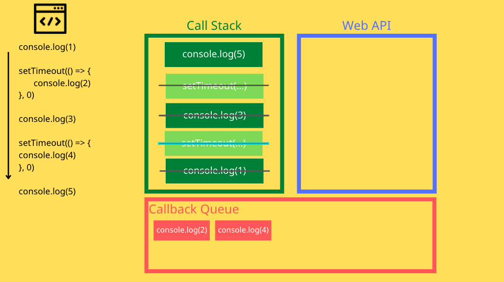

```
console.log(1)
setTimeout(() => {
  console.log(2)
}, 0)
console.log(3)
setTimeout(() => {
  console.log(4)
}, 0)
console.log(5)
```

執行程式 => console.log(1) => 遇到 setTimout ，請 web API 幫我們設定計時器，0 秒後，把 `()=>{console.log(2)}` 放到 callback queue 待命


繼續執行程式 => console.log(3) => 遇到 setTimout ，請 web API 幫我們設定計時器，0 秒後，把 `()=>{console.log(4)}` 放到 callback queue 待命


繼續執行程式 => console.log(5)


將最後一行 console.log(5) 執行完後 ， 此時主程式已經沒有程式可以跑了。 就會看看 callback queue 有沒有工作要執行！


還有兩個剛剛請 web API 幫忙設定計時器的 function 要執行 => 執行 callback queue 第一個 function，`()=> {console.log(2)}` => 結束後執行第二個 function


這樣就可以知道答案是 1 3 5 2 4。