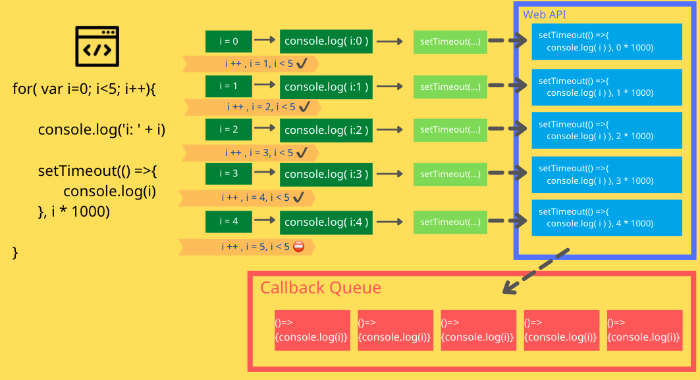

```
for(var i=0; i<5; i++) {
  console.log('i: ' + i)
  setTimeout(() => {
    console.log(i)
  }, i * 1000)
}
```

程式進入 for 迴圈後，宣告 i = 0 ，確定是不是 i < 5 ，如果是，就進入迴圈裡面執行程式，如果不是就會離開迴圈。



進入迴圈裡面後，執行 `console.log('i: ' + i)`，此時的 i = 0 ，就會印出 ` i: 0`，接著遇到 ```setTimeout(() =>{
console.log(i)
}, 0 * 1000)```，會將 setTimout 丟給 web API 處理，web API 就會知道 『  0*1000 毫秒後要丟出 `console.log(i)` 到 callback queue 中 』，然後回到迴圈內跑剩下的程式，沒程式了，那就執行 `i++`，此時 `i=1`，然後開始剛剛的步驟，如圖所示，直到 `i = 5` ， 此時 ` i < 5` 就不成立了，跳出迴圈！


( 比較特別要的注意的事是當 setTimout 給 Web API 執行的時候， Web API 就會根據設定的時間去計算何時要把 function 丟入 Callback Queue 了，也就是當 i = 0 的時候，0秒後丟入 Callback Queue, i = 1, 就是 1 秒後丟入 Callback Queue  .... 以此類推。)


接下來因為沒有程式要跑了，就會來看看 Callback Queue 有沒有工作要做！
就是圖示中粉紅色區塊，總共有 5 個程序等著呢！但是這時候因為主程序已經跑完， i 已經是 5 了，所以在執行這 5 個程序的時候，會印出 5 次的 5。


綜合以上簡單的文字說明和我可能不夠詳細的圖片，可以知道當把那段代碼去執行後是會印出以下結果的 ：

```
i: 0
i: 1
i: 2
i: 3
i: 4
5
5
5
5
5
```

但是如果這個題目將 `var i = 0` 改成 `let i = 0` 那麼答案就不會一樣了，這個就跟作用域有關係，因為使用 var 時，i 是 global，如果使用的是 let ，那麼每一次的迴圈的 i 都是獨立的，不會互相干擾。