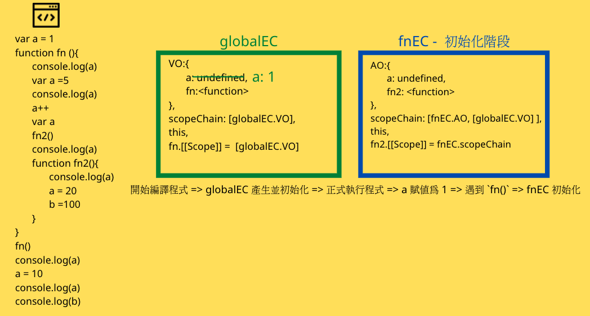
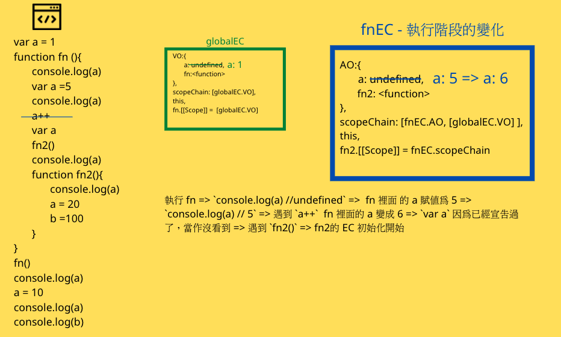
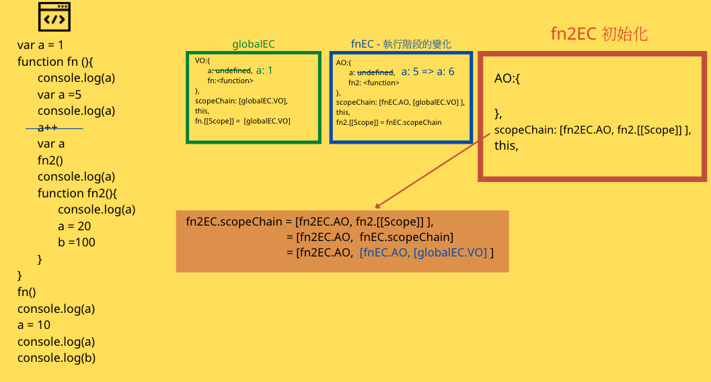
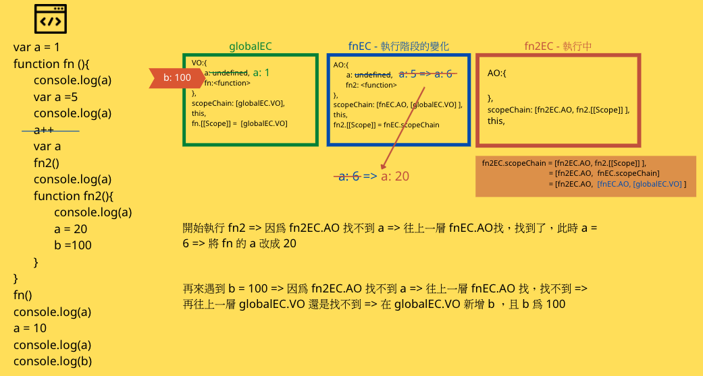

```
var a = 1
function fn(){
  console.log(a)
  var a = 5
  console.log(a)
  a++
  var a
  fn2()
  console.log(a)
  function fn2(){
    console.log(a)
    a = 20
    b = 100
  }
}
fn()
console.log(a)
a = 10
console.log(a)
console.log(b)
```



## Step1
開始編譯程式 => globalEC 產生並初始化 => 正式執行程式 => global 的 a 賦值為 1 => 遇到 `fn()` => fnEC 初始化  

要特別注意在 fnEC初始化的時候，會遇到 `var a =5` ，此時即時 global 已經有 a 了，還是會宣告 a 一次，並且初始化成 undefined，
如果程式改成這樣，

```
var a = 1 
function fn(){
    console.log(a)
}
```

那麼 fnEC 就不會再宣告一次，且會印出 1。

那麼因為 fn 裡面有再宣告一次 `var a =5`，所以再第二次遇到 `var a` 的時候，會忽略它，因為已經宣告過了。
這是因為 var 允許重複宣告的特性，如果是改用 let 的話，程式就會報錯！

###此時 globalEC 與 fnEC 的 scopeChain 如下：

> fnEC.scopeChain = [fnEC.AO, fn.[[Scope]] = [fnEC.AO, [globalEC.VO]]


> fn2.[[Scope]] = fnEC.scopeChain = [fnEC.AO, fn.[[Scope]]] = [fnEC.AO, [globalEC.VO]]


## Step2
執行 fn => `console.log(a) //undefined` =>  fn 裡面 的 a 賦值為 5 => `console.log(a) // 5` => 遇到 `a++`  fn 裡面的 a 變成 6 => `var a` 因為已經宣告過了，當作沒看到 => 遇到 `fn2()` => fn2的 EC 初始化開始




進入 fn2 初始化 => 沒有遇到變數與 function 的宣告 => 所以初始化階段只有建立 scopeChain => (fn2EC.scopeChain 詳細描述在圖示中) 



開始執行 fn2 => `console.log(a) // 6` => 遇到 `a = 20` ，將 fn 的 a 改成 20 => 遇到 `b=100` ，因為在 scopeChain 都找不到 => 在非嚴格模式下會在 global 建立 b 且 b =100 ，如果是嚴格模式下會報錯。



fn2 執行完畢 => 回到 fn 繼續執行 => `console.log(a) //20` => fn 執行完畢 => 回到 global => `console.log(a) //1`  因為目前已經是在 global 中，所以會從 globalEC.scopeChain 找 a ，這時候的 a 為 1 => 再來又將 a 重新賦值為 10 => globalEC.VO 裡面的 a 從 1 變成 10 => `console.log(a) // 10` => `console.log(b) //100` 剛剛在 fn2 時有遇到 `b=100` 時就已經幫我們在 globalEC 加上 b=100 了，所以 b = 100。   

將以上的步驟拼湊起來，我們可以得到這個程式跑出來的結果：
```
5
6
20
1
10
100
```