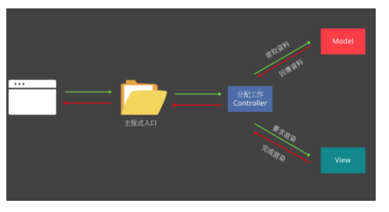

## 什麼是 MVC？
瀏覽器發出 request 後，Controller 接收到 request，丟出資料給 Model 執行，Model 處理完畢後再回傳資料給 Controller，收到資料後交給 View 處理畫面部分，處理完後再丟給 Controller ，然後再回傳 response 給瀏覽器。

責任劃分就是如下：

- Modle, M : 處理資料
- View, V : 處理畫面
- Controller, C : 處理資料與畫面的溝通
  
  

## 請寫下這週部署的心得

一步一步跟著老師走，其實不太會有差錯！

這幾次部署下來的心得，我發現看得懂官方提供的文件非常重要！

簡單記錄一下步驟
- 本地專案要先 `git init`
- 執行 `heroku create` 讓 本地git 可以遠端到 heroku，並且產生一個 heroku app
- `git push heroku main` 正式部署到 heroku
- 安裝 `clearDB`
- 大功告成

## 寫 Node.js 的後端跟之前寫 PHP 差滿多的，有什麼心得嗎？

一開始寫 PHP 的時候很痛苦，因為不熟悉 PHP，我記得那一週我告訴自己，應該使用 JS 寫會好很多。
實際上到這週作業的時候，才發現事情不是我想的那樣。

記得寫 week17 hw1 的時候因為不熟悉 ORM ，所以官方文件看了關，關了開來看，重複好多次，
再來因為初嘗試 MVC 的關係，知道怎麼切分，可是卻不知道怎麼實作切分...，
自己畫了一張圖之後才比較理解，後來想的 code 需要 debug 的時候，深深的感覺到 MVC 的好處，哪邊出錯非常的容易抓到。

### week17 作業心得紀錄
hw1:
  https://stark-refuge-58656.herokuapp.com/
帳密：admin/ admin

本來是要實作也有留言功能的留言板，使用者沒註冊的話可以瀏覽blog，但不能留言，可以註冊一個帳號，role 為 vistor，可以針對單篇文章留言。
但是後來因為進度落後太多，所以只將留言板 table 設置好，也可以顯示目前最新的留言，但還沒有實作留言的 UI 還有後端。

hw2 前台串API抽寵物 https://radiant-refuge-16420.herokuapp.com/
後台API管理 https://radiant-refuge-16420.herokuapp.com/login
帳密： admin/ admin
或者可以直接註冊一個進入管理頁面

hw2 心得：
因為 week11 重做了一兩次，所以讓 hw2 後端沒有卡太多問題，
但就是數學不太好，不知道怎麼去設置機率，想了一個下午才想出來。
本來要使用 imgur upload 搭配 multer，大概看了一下做法後，怕延誤進度就先暫緩了。
