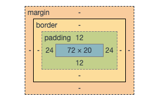

## 請找出三個課程裡面沒提到的 HTML 標籤並一一說明作用。

- article - 文章
- aside - 主要內容以外的東西 ex 側邊的資訊欄
- caption - HTML 表格的標題
- canvas - 畫布，可通過 javascript 動態繪製圖表(形)
- address - 用於呈現地址
- datalist - 跟 input 搭配使用可以做出下拉式選單
- figure - 與網站內容相關的照片、圖表 ... 等。 `<figcaption>`可以為 figure 增加標題
-

## 請問什麼是盒模型（box modal）

每個元素產生的矩形區域會產生一個 box ，這個 box 從內而外分別是以下這邊組成
content area > padding > border > margin 如下圖：

- content area：就是元素的內容原本的 width, height，如上圖就是 72 \* 20。
- padding 內距：圖中綠色的區域，可以解釋成元素本身與外面的距離，例如圖中元素內容與上下 padding 為 12px, 左右為 24px。
- border ：就是 border 。
- margin 外距：此元素與其他元素的距離。

> 寬度：左邊 margin + 左邊 border + 左邊 padding + 元素本身的 width + 右邊 padding + 右邊 border + 右邊 margin

> 高度： 上下 margin + 上下 border + 上下 padding + 元素本身 height

## 請問 display: inline, block 跟 inline-block 的差別是什麼？

- block - 佔滿了全寬。 ex: div, h1-h6, form, header, footer, section。
- inline - 只會佔滿元素需要的寬度，且不會像 block 一樣佔全寬，所以可以拿來並排。 ex: span, a, img。
  - 不能設寬跟高
  - padding, margin 左右有作用，上下的話也有作用但是不會把周邊元素推移，而是會覆蓋。
- inline-block - 同時有 inline 和 block 的特性。
  - 可以像 inline 一樣將元素並排，也可以像 block 一樣設定寬跟高。

## 請問 position: static, relative, absolute 跟 fixed 的差別是什麼？

- static - 元素預設就是 static。
- relative -
  - 可依照原本的位置，去做相對的調整 top, left, right, bottom，
  - 給了定位之後， z-index 比重會提高，但是原本的版面會留著。
- absolute -

  - 周圍的元素會重新排版，因為設定 absolute 的元素自己會獨立一層，脫離了原本的排版。
  - 元素設定了 absolute 後，會一直往父層找，找到第一個非 static 的元素來做定位。

  > 如果怎麼找都找不到，最後會根據 viewport 來做定位

- fixed - 不管畫面怎麼捲動，"看"起來都會像在同一個位置。
  - 設了定位之後，會依據 viewport 來做定位，所以看起來就像沒有移動過，並且會自己獨立一層。
  - 常應用在 back to Top 或 導覽列的功能
