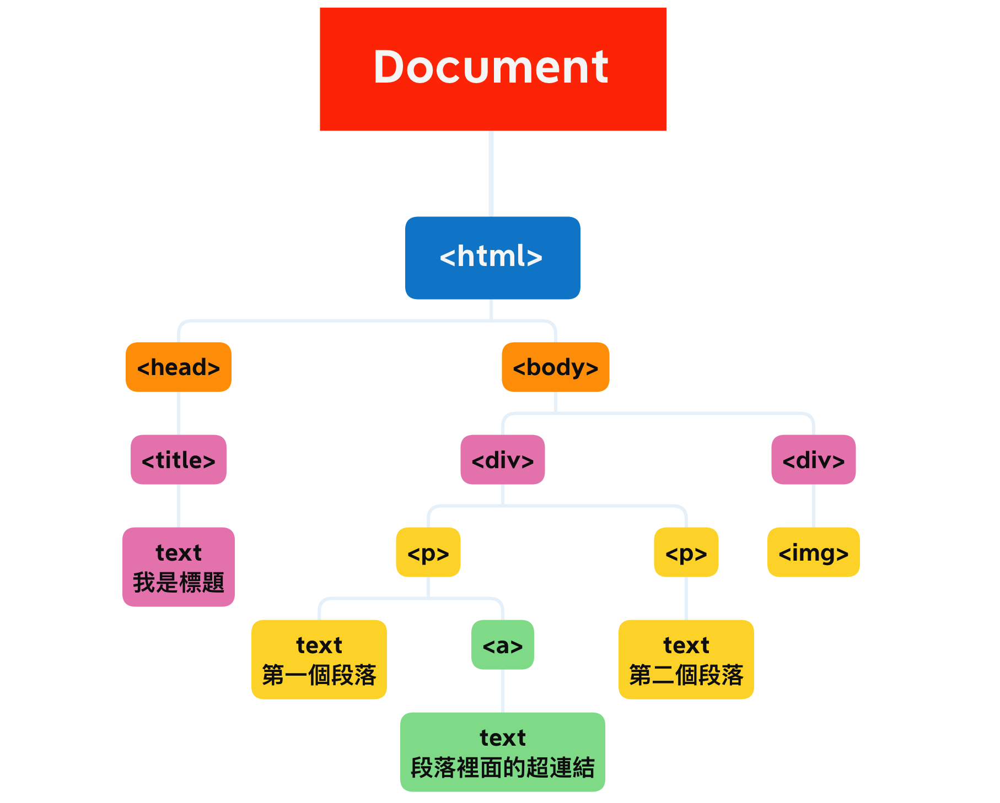
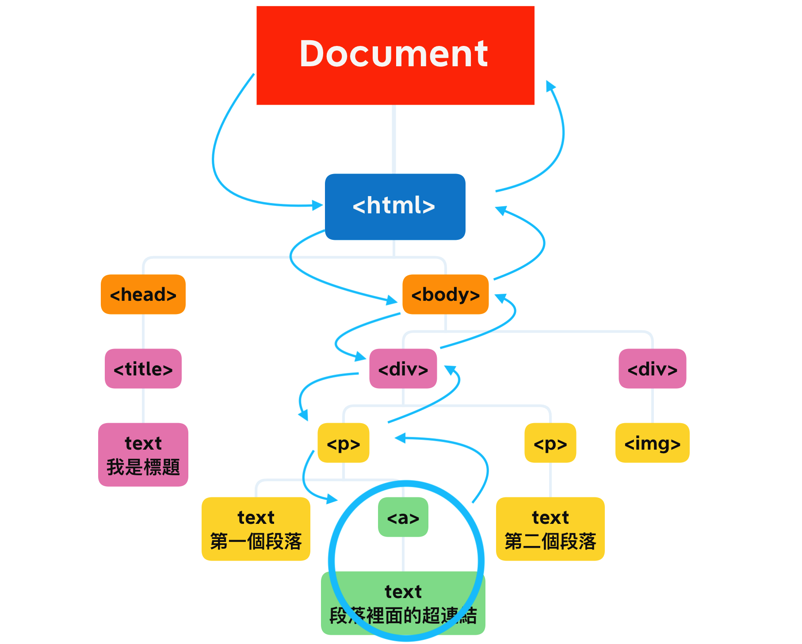

## 什麼是 DOM？
DOM，全名是 Document Object Model，文件物件模型。

有了DOM之後，我們可以利用 JavaScript 對 html 或 XML 元素進行訪問或操控。例如：改變文字內容、改變 HTML 屬性、或者 CSS style；也就是說 DOM 就像一個橋樑，來連接 HTML 和 JavaScript 兩者。

HTML 網頁被瀏覽器載入後，就會產生 DOM 樹狀結構，你可以想像就像公司的組織圖那樣，並且在 DOM 中每個一個 HTML element 都是一個 object。

```
<html>
	<head>
	  <meta charset="UTF-8">
	  <title>我是標題</title>
	</head>

<body>
  <div>
    <p>
      第一個段落
      <a>段落裡面的超連結</a>
    </p>
    <p>
      第二個段落
    </p>
  </div>
  <div>
    
  </div>
</body>
</html>
```
### DOM 圖示 (就像族譜還是公司組織圖那樣)


---
DOM 以 Document 為最頂層，也就是 html 和 Javascript 之間的入口點！
所以當我們需要操控 DOM 的時候語法就會像這樣 ` document.querySelector('className') `。

在圖示中可以發現 document 之後，是 html 。 document 是門口，html 就是第一個 element ，在接下來就是 head, body ... 一層一層下來。


前端菜雞我以前傻傻的以為 DOM 是 JS 的一部份，實際上**不是這樣**，DOM 是個 Web API ，就像前幾週學的，API 就是個介面，提供了很多方法讓我們可以使用。
## 事件傳遞機制的順序是什麼；什麼是冒泡，什麼又是捕獲？
以剛剛示範的 DOM 結構來模擬事件傳遞，假設現在我們點擊了 `<a> 段落裡面的連結</a>`後，DOM會觸法一個 click 事件，而此事件並不是從 `<a>` 出發，而是從 document 的根部出發，並且從那裡開始它的 **捕獲 capture** 旅行(補貨 😆)，一直往南走、往下走，途中會通過每個`<a>` 的父層 element，直到抵達目標元素 `<a>`。
> document → html → body → div → p → **a**

訪問到 `<a>` 後，就會執行點擊事件中的程式內容，此階段就是 <strong> target phrase </strong>。到達目標後，事件又會開始**冒泡 bubble** 旅行從 target 這個階段往北走，走回 document，。

> **a** → p → div → body → html → document


跟捕獲階段一樣，會訪問 `<a>` 的每個父元素。


當事件開始冒泡旅行的時候，事件也會傳遞給每個父元素，也就是說假設 `<p>` 也有設置監聽 click 事件 的話，也會被觸發。

在預設狀況下，當我們建立監聽事件的時候，是建構在冒泡階段。

```javascript
document.querySelector( 'a' ).addEventListener('Click', fucntion(){
//...省略
}, false)
```

> addEventListener 的 第三個參數 false 沒打出來也無所謂，預設就是 false ，也就是事件建置在冒泡階段；相反，如果是 true，就是捕獲階段。

## 什麼是 event delegation，為什麼我們需要它？

以上面的圖示來說明 event delegation 的話，如果今天圈起來的 `<a>` 有一百個還是一千個呢？ 我們建立的監聽事件可能就會有上百個上千個。此時就可以利用 event delegation 來訪問父元素或子元素，而不需要每個都加入 addEventListener。

> 假設我們在圖示中的 `<div>` 建置 addEventListener 的話，此時點擊`<div>`底下的`<p>` 或者是 `<a>` 都可以觸發事件。

這樣我們就不需要 div, p, a 建置三個監聽事件了。


## event.preventDefault() 跟 event.stopPropagation() 差在哪裡，可以舉個範例嗎？
承上題，如果我們在 `<div>` 上 加上 `event.stopPropagation()` 的話，就可以阻止冒泡繼續旅行，底下的 p , a 就不會接收到事件。

`event.preventDefault()` 是指停止 DOM 的預設功能，例如標籤 `<a>` 本身有跳轉頁面的功能，如果我們使用 event.preventDefault() 後就不會執行跳轉頁面了。


> 在 html body 上加入第一段程式```<a href="https://learning.lidemy.com/">Lidemy learning</a>```，
> 然後在 script 中加入 
> ```
document.querySelector('a').addEventListener('click', (e) => {
      e.preventDefault()
    })
    ```
> 這樣就連不到 lidemy了